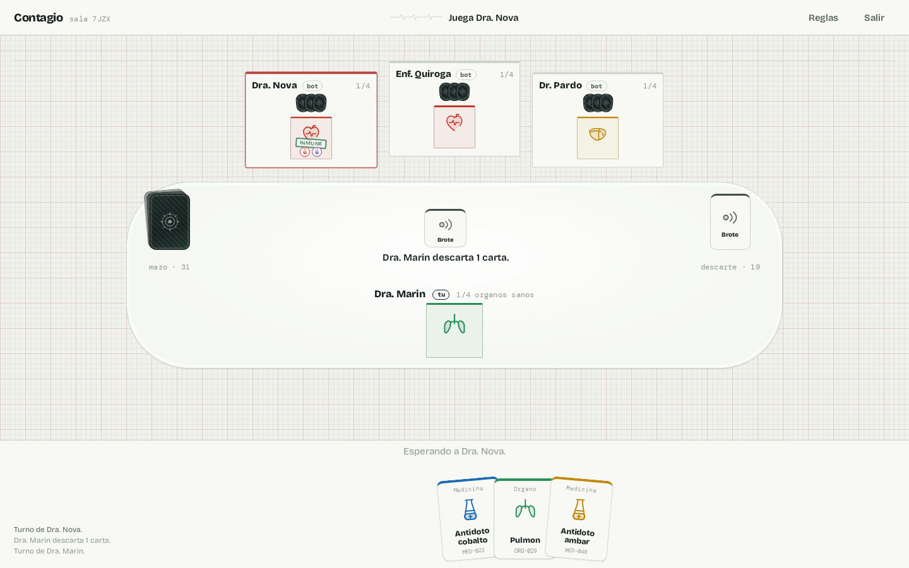
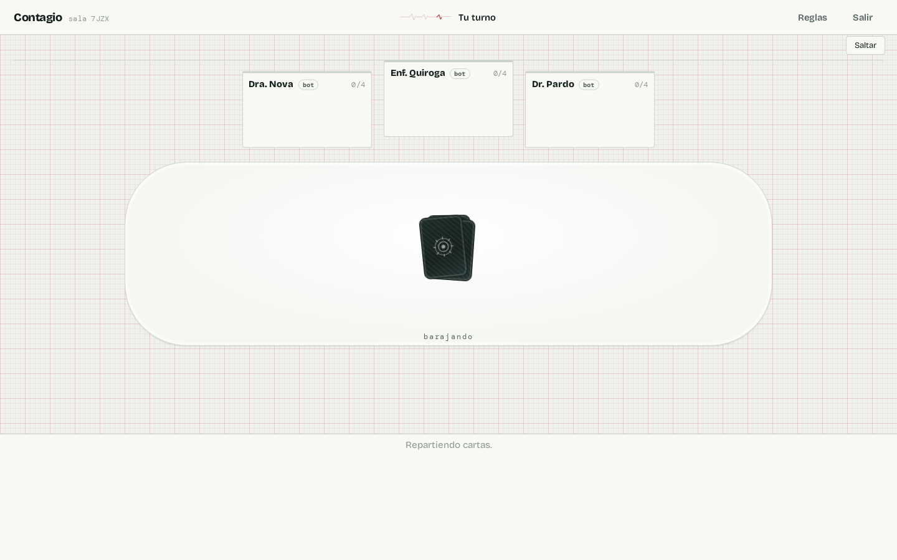
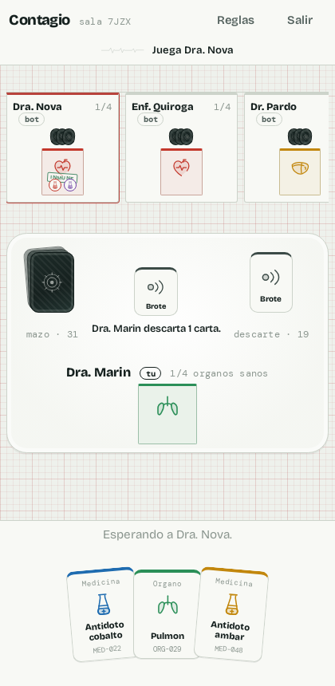

# Contagio

Juego de cartas por turnos para 2–6 jugadores, en tiempo real y con bots. Reúne cuatro órganos sanos antes que
el resto mientras les infectas, extirpas o robas los suyos.

Proyecto de portafolio: reglas propias del género de cartas de sabotaje médico, con ilustraciones, textos y código
originales.



| Reparto inicial | Móvil |
| --- | --- |
|  |  |

## Cómo se juega

- **Objetivo**: cuatro órganos sanos de distinto color sobre la mesa. Sano = sin virus encima (libre, vacunado o inmune).
- **Turno**: juegas una carta *o* descartas las que quieras; después robas hasta tener tres en la mano.
- **Virus**: infecta un órgano libre, extirpa uno ya infectado o rompe una vacuna.
- **Medicina**: cura un virus, vacuna un órgano libre o —con la segunda— lo inmuniza para siempre.
- **Tratamientos**: intercambio quirúrgico, extracción ilegal, brote, cuarentena y negligencia médica.

El mazo son 68 cartas: 21 órganos, 17 virus, 20 medicinas y 10 tratamientos.

## El ritmo de la mesa

Una partida se juega sola si nadie la lee. Tres decisiones hacen que los turnos ajenos se entiendan:

- **Los bots se toman su tiempo** (3 s por turno, ajustable con `BOT_DELAY_MS`). No es tiempo de cálculo: es tiempo de
  lectura.
- **Cada jugada se anuncia en el centro** con la carta que se ha jugado y una frase — "Dr. Pardo roba el Hígado de
  Enf. Quiroga" — y el órgano afectado parpadea un instante.
- **El reparto se ve**: las cartas se barajan en el centro, salen una a una hacia cada jugador y el mazo se retira
  después a su sitio. Se puede saltar, y se omite si el sistema pide movimiento reducido.

## Arquitectura

```
packages/
  engine/   Motor de reglas en TypeScript puro, sin dependencias. Estado + acción -> estado.
  server/   Node + Socket.IO. Servidor autoritativo: salas, turnos, bots y reconexión.
  client/   React + Vite. Arte SVG propio, sin librería de UI.
```

Decisiones que sostienen el proyecto:

- **El motor no sabe nada de red ni de React.** `applyAction(state, playerId, action)` es una función pura que
  devuelve un estado nuevo o un error. Eso permite testear reglas sin levantar nada y reusarlas en los bots.
- **El servidor es la única fuente de verdad.** El cliente nunca recibe las manos ajenas: `toPlayerView` proyecta el
  estado para cada jugador e incluye la lista de jugadas legales, que es también lo que la interfaz usa para
  resaltar objetivos válidos.
- **Los bots usan el propio motor.** `chooseBotAction` puntúa cada jugada legal simulándola con `previewAction`;
  la misma heurística cubre el turno de un jugador que se desconecta.
- **Reconexión sin perder el asiento**: cada jugador guarda un token y vuelve a su sitio con `room:resume`.

## Desarrollo

```bash
npm install
npm run dev          # servidor en :3001 y cliente en :5173
```

`npm run dev` levanta tres procesos y los apaga juntos con Ctrl+C: `tsc -b --watch` recompila motor y
servidor, el servidor se reinicia solo con `node --watch` cuando cambia su salida, y Vite sirve el cliente
con recarga en caliente. Se compila en lugar de ejecutar los `.ts` directamente porque los imports llevan
extension `.js` (modo NodeNext) y el interprete no las traduce al vuelo.

Otros comandos:

```bash
npm test                              # tests del motor (node:test)
npm run test --workspace=@contagio/server   # partida completa por socket, de punta a punta
npm run build                         # compila los tres paquetes
npm run typecheck
```

En producción el mismo proceso Node sirve el cliente compilado y el socket:

```bash
npm run build && node packages/server/dist/index.js   # http://localhost:3001
# o
docker compose up --build
```

Variables: `PORT` (3001), `CORS_ORIGIN` (`*`), `VITE_SERVER_URL` para apuntar el proxy de desarrollo a otro servidor.

## Tests

- `packages/engine/test/engine.test.ts`: composición del mazo, cada efecto de carta, victoria, y una partida completa
  entre bots que comprueba en cada turno que las 68 cartas siguen existiendo, sin duplicados ni pérdidas.
- `packages/server/test/smoke.test.mjs`: levanta el servidor real, juega una partida por socket con dos clientes y
  un bot, y verifica que termina con un ganador con cuatro órganos sanos.

## Revisión visual

`tools/shots.mjs` levanta el servidor, juega una partida con bots en un navegador y guarda capturas de cada pantalla.
Sirve para revisar el diseño sin abrirlo a mano y para regenerar las imágenes de este README:

```bash
node tools/shots.mjs                      # capturas a 2x en tools/shots/
SHOT_SCALE=1 node tools/shots.mjs docs/capturas
```

Necesita un Chromium accesible por CDP en `localhost:9222`. En una máquina sin las librerías de escritorio:

```bash
docker run -d --rm --name contagio-chrome --network host zenika/alpine-chrome \
  --no-sandbox --headless --remote-debugging-address=0.0.0.0 --remote-debugging-port=9222 about:blank
```

## Créditos

Contagio toma la mecánica del género de juegos de cartas de sabotaje médico —órganos, virus y medicinas— y la
reescribe por completo: nombres, textos, ilustraciones vectoriales, equilibrio de interfaz y código son originales
de este proyecto.
