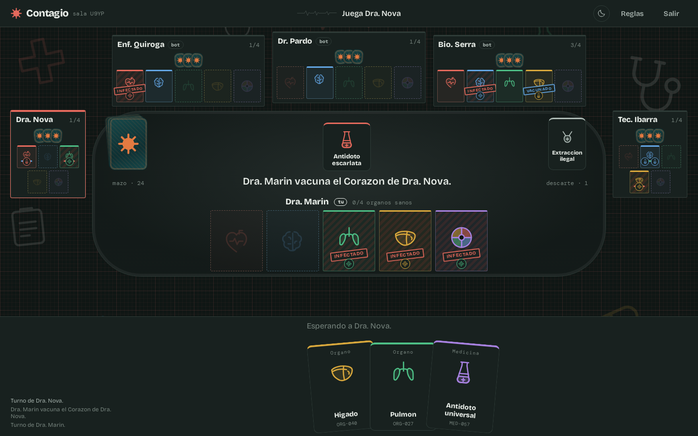

# Contagio

Juego de cartas por turnos para 2–6 jugadores, en tiempo real y con bots. Reúne cuatro órganos sanos antes que
el resto mientras les infectas, extirpas o robas los suyos.

Proyecto de portafolio: reglas propias del género de cartas de sabotaje médico, con ilustraciones, textos y código
originales.


| Reparto inicial | Móvil, en oscuro |
| --- | --- |
|  |  |



## Cómo se juega

- **Objetivo**: cuatro órganos sanos de distinto color sobre la mesa. Sano = sin virus encima (libre, vacunado o inmune).
- **Turno**: juegas una carta *o* descartas las que quieras; después robas hasta tener tres en la mano.
- **Virus**: infecta un órgano libre, extirpa uno ya infectado o rompe una vacuna.
- **Medicina**: cura un virus, vacuna un órgano libre o —con la segunda— lo inmuniza para siempre.
- **Tratamientos**: intercambio quirúrgico, extracción ilegal, brote, cuarentena y negligencia médica.

El mazo son 68 cartas: 21 órganos, 17 virus, 20 medicinas y 10 tratamientos.

## Paquetes de cartas

Antes de empezar, el anfitrión elige en la sala con qué mazo se juega; el resto ve la elección y el fondo cambia en el
acto. La mecánica es siempre la misma: cambian los nombres, lo que dice cada carta, sus dibujos y la decoración de fondo.

| Paquete | Lo que se protege (órganos + comodín) | Ataque | Defensa | Especiales | Música |
| --- | --- | --- | --- | --- | --- |
| **Contagio** (por defecto) | Corazón, Cerebro, Pulmón, Hígado, Órgano quimérico | Virus | Medicinas | Tratamientos | *Sala de espera*: latido y campanas de monitor |
| **Héroes DC** | Flash, Superman, Linterna Verde, Batman, Mujer Maravilla | Villanos | Refuerzos | Eventos | *Marcha heroica*: metales, bajo al galope y timbales |
| **Héroes Marvel** | Iron Man, Capitán América, Hulk, Thor, Spider-Man | Villanos | Refuerzos | Eventos | *Llamada a filas*: himno en menor con ostinato de cuerda |
| **Frutero** | Fresa, Arándano, Kiwi, Plátano, Macedonia | Plagas | Conservas | Imprevistos | *Puesto del mercado*: marimba saltarina |
| **Cortafuegos** | Procesador, Base de datos, Router, Fuente de poder, Nube híbrida | Malware | Parches | Comandos | *Sala de servidores*: arpegio de sintetizador |
| **Órbita** | Reactor, Soporte vital, Invernadero, Panel solar, Módulo prototipo | Averías | Reparaciones | Maniobras | *Órbita baja*: lidio, casi sin ritmo |
| **Asedio** | Armería, Pozo, Huerto, Tesoro, Torre del homenaje | Asaltos | Defensas | Estratagemas | *Guardia en la muralla*: flauta dórica y tambor |
| **Arrecife** | Cangrejo, Ballena, Tortuga, Pez globo, Pulpo mimético | Amenazas | Rescates | Mareas | *Bajo la marea*: acordes de séptima que flotan |
| **Grimorio** | Fuego, Agua, Bosque, Rayo, Éter | Maldiciones | Runas | Conjuros | *Tomo prohibido*: frigio sobre un bordón |
| **Jurásico** | Tiranosaurio, Pterodáctilo, Diplodocus, Triceratops, Huevo misterioso | Peligros | Refugios | Fenómenos | *Valle perdido*: trompa y toms |
| **Banda** | Guitarra, Batería, Teclado, Trompeta, Tocadiscos | Ruidos | Afinaciones | Escenario | *Último ensayo*: riff con batería |
| **Piratas** | Loro, Barco, Mapa, Catalejo, Isla del tesoro | Desastres | Remedios | Tretas | *Taberna del puerto*: jiga en 12/8 |

Un paquete es texto en el motor (`packages/engine/src/packs.ts`) y dibujo en el cliente
(`packages/client/src/packs/`). El texto incluye las plantillas con las que el registro cuenta cada jugada —«Ana
captura al Batman de Luis», «Ana pudre la Fresa de Luis»— y el género de cada nombre, para que los artículos
concuerden. Ninguna regla sabe qué paquete se juega. Los cuatro colores significan lo mismo en todos los mazos, y el
comodín de cada uno lleva los cuatro.

**Héroes DC y Héroes Marvel son paquetes de aficionado**: los personajes pertenecen a DC Comics y a Marvel, y aparecen
con su nombre a petición del autor. Los emblemas son dibujos propios, no los logotipos oficiales, y las reglas del
juego llevan la nota de derechos de cada uno.

## El ritmo de la mesa

Una partida se juega sola si nadie la lee. Tres decisiones hacen que los turnos ajenos se entiendan:

- **Los bots se toman su tiempo** (4,5 s por turno, ajustable con `BOT_DELAY_MS`). No es tiempo de cálculo: es tiempo
  de lectura.
- **Cada jugada se anuncia en el centro**, en grande, con la carta que se ha jugado y una frase — "Dr. Pardo roba el
  Hígado de Enf. Quiroga" — y el órgano afectado parpadea un instante.
- **Cada cuerpo tiene cinco huecos fijos**, uno por color más el comodín, así que colocar una carta no mueve la mesa
  y se ve de un vistazo a quién le falta qué. Con cuatro rivales o más, los costados de la mesa se ocupan en lugar de
  estrechar la fila de arriba: ahí el asiento es grande, porque ese espacio no lo quiere nadie más.
- **Todo se juega señalando su sitio**: el órgano cae en su hueco, el virus sobre el órgano que ataca y la negligencia
  médica sobre la mesa entera del rival —esa, además, pregunta antes, porque cambiar el cuerpo completo no tiene
  vuelta atrás.
- **Un minuto por turno** (`TURN_LIMIT_MS`) cuando juega una persona, con un aro que se gasta junto al indicador de
  turno. Si llega a cero, la mesa juega por ella con la misma heurística de los bots: nadie se queda esperando a
  alguien que se ha levantado. Los bots no llevan reloj.
- **Cada cual ve la mesa desde su silla**: los rivales se sientan en el orden en que juegan después de ti —el
  siguiente a tu izquierda, el anterior a tu derecha—, así que el turno da la vuelta a la mesa en el mismo sentido
  para todos, no solo para el anfitrión.
- **Tu turno no pasa desapercibido.** Había quien no se enteraba de que le tocaba: miraba su mano, no la barra. Ahora
  el aviso llega por varios sitios a la vez —una franja «Tu turno» cruza la mesa, suena una llamada de metales que
  aparta la música un momento, la barra se enciende, tu zona se tiñe y las cartas jugables dan un salto—, el móvil
  vibra, y la pestaña del navegador dice «Tu turno» para quien espera mirando otra. Si pasan veinte segundos sin que
  toques nada, la mesa lo recuerda una vez. El rival que juega lleva marco y un piloto junto al nombre. Nada de esto
  mueve la mesa: todo pinta sobre medidas que ya existían.
- **La mesa suena**: barajado y reparto al empezar, la llamada de tu turno, un golpe distinto según la jugada, el tic
  de tus últimos diez segundos y un arpegio al terminar. Todo se sintetiza en el navegador con Web Audio
  —osciladores y ruido filtrado, sin un solo archivo de audio—.
- **Cada paquete tiene su música**, compuesta para el juego y escrita como partitura en `client/src/score.ts`: unos
  compases de acordes y melodía con bajo, arpegio y percusión en patrones. Tampoco es un archivo: se sintetiza y se
  programa sobre el reloj del audio, y al cambiar de paquete en la sala una pieza se funde con la siguiente. Suena
  desde que entras en una sala y calla si la pestaña pasa a segundo plano.
- **Volumen por separado**: el botón de sonido abre un panel con un deslizador para la música, otro para los efectos
  y un «silenciar todo» que no pisa los volúmenes. Se recuerda entre visitas.
- **El reparto se ve**: las cartas se barajan en el centro, salen una a una hacia cada jugador y el mazo se retira
  después a su sitio. Se puede saltar, y se omite si el sistema pide movimiento reducido.
- **Quien abre sale por sorteo**, no es el anfitrión: abrir es una ventaja pequeña pero constante. El sorteo usa la
  misma semilla que baraja y la mesa lo anuncia en el centro, ya repartidas las cartas.

## Novedades

La pantalla de inicio anuncia la versión vigente con sus tres cambios principales y abre el historial completo. Las
notas viven en `packages/client/src/releases.ts`, escritas para quien juega —qué cambia en la mesa, no qué archivo se
tocó—, y la etiqueta de «nuevo» se apaga cuando se abre el historial. La versión de los `package.json` sigue a la
primera entrada de esa lista.

## Tema y fondo

El tema arranca en **automático**: manda `prefers-color-scheme`, que es lo que ya tiene decidido quien juega. El botón
de la barra recorre *automático → claro → oscuro* y solo entonces fija la elección en `localStorage`. La hoja de
estilos conoce únicamente el resultado (`data-theme="light" | "dark"`), así que la paleta no se duplica en un `@media`;
un script en línea de `index.html` la aplica antes del primer pintado para que la página no asome en claro.

En oscuro los cuatro colores de órgano suben de luz: ahí el color es información, no adorno, y los tonos claros se
apagan sobre fondo oscuro. El reverso de carta no cambia con el tema —verde de quirófano y la marca en naranja—
porque es el mismo objeto sobre la mesa. De fondo, instrumental de hospital dibujado a línea, muy tenue y por los
márgenes, sin ratón ni lector de pantalla.

## Arquitectura

```
packages/
  engine/   Motor de reglas en TypeScript puro, sin dependencias. Estado + acción -> estado.
  server/   Node + Socket.IO. Servidor autoritativo: salas, turnos, bots y reconexión.
  client/   React + Vite. Arte SVG propio, sin librería de UI.
```

Decisiones que sostienen el proyecto:

- **El motor no sabe nada de red ni de React.** `applyAction(state, playerId, action)` es una función pura que
  devuelve un estado nuevo o un error. Eso permite testear reglas sin levantar nada y reusarlas en los bots.
- **El servidor es la única fuente de verdad.** El cliente nunca recibe las manos ajenas: `toPlayerView` proyecta el
  estado para cada jugador e incluye la lista de jugadas legales, que es también lo que la interfaz usa para
  resaltar objetivos válidos.
- **Los bots usan el propio motor.** `chooseBotAction` puntúa cada jugada legal simulándola con `previewAction`;
  la misma heurística cubre el turno de un jugador que se desconecta.
- **Reconexión sin perder el asiento**: cada jugador guarda un token y vuelve a su sitio con `room:resume`.

## Desarrollo

```bash
npm install
npm run dev          # servidor en :3001 y cliente en :5173
```

`npm run dev` levanta tres procesos y los apaga juntos con Ctrl+C: `tsc -b --watch` recompila motor y
servidor, el servidor se reinicia solo con `node --watch` cuando cambia su salida, y Vite sirve el cliente
con recarga en caliente. Se compila en lugar de ejecutar los `.ts` directamente porque los imports llevan
extension `.js` (modo NodeNext) y el interprete no las traduce al vuelo.

Otros comandos:

```bash
npm test                              # tests del motor (node:test)
npm run test --workspace=@contagio/server   # partida completa por socket, de punta a punta
npm run build                         # compila los tres paquetes
npm run typecheck
```

En producción el mismo proceso Node sirve el cliente compilado y el socket:

```bash
npm run build && node packages/server/dist/index.js   # http://localhost:3001
```

### Producción

El juego está publicado en **https://contagio.emiigg.dev**. La máquina tiene un nginx global en `/opt/infra`, delante
de otros proyectos, que enruta por dominio a contenedores de la red docker externa `web`:

```bash
git pull && docker compose -f /opt/contagio/docker-compose.yml up -d --build
```

El contenedor entra en `web` con el alias `contagio-web` y no publica puerto en el host, así que el 3001 sigue libre
para `npm run dev`. Su bloque de nginx es `/opt/infra/conf.d/contagio.conf`, con las cabeceras de WebSocket que
necesita Socket.IO y el socket abierto hasta una hora. El certificado de Let's Encrypt es propio del subdominio y se
renueva con el cron que ya tenía `/opt/infra`.

Variables: `PORT` (3001), `CORS_ORIGIN` (`*`), `VITE_SERVER_URL` para apuntar el proxy de desarrollo a otro servidor.

### Cuidar el servidor

Cada sala vive en memoria y mantiene un temporizador para los bots, así que hay un techo de partidas simultáneas:

- **`MAX_ROOMS` (5)**: al llegar al tope, crear sala responde con un aviso de volver más tarde en lugar de servir seis
  partidas a tirones. Entrar con código a una sala existente sigue funcionando.
- **`TURN_LIMIT_MS` (60 000)**: lo que dura el turno de una persona antes de que la mesa juegue por ella.
- **`EMPTY_GRACE_MS` (60 000)**: una sala sin humanos conectados se cierra pasado ese margen. No es cero porque
  recargar la página es una desconexión: quien vuelve dentro de ese minuto se reencuentra su partida donde la dejó.
  Si no queda ni el asiento de un humano —todos se fueron del vestíbulo—, se cierra en el acto.

`GET /health` responde con las salas abiertas y el tope.

## Tests

- `packages/engine/test/engine.test.ts`: composición del mazo, cada efecto de carta, victoria, y una partida completa
  entre bots que comprueba en cada turno que las 68 cartas siguen existiendo, sin duplicados ni pérdidas. De los
  paquetes comprueba que cada uno nombra las 20 cartas distintas, que sus textos van sin tildes y sin huecos por
  rellenar, y que el registro cuenta la jugada en su vocabulario.
- `packages/server/test/smoke.test.mjs`: levanta el servidor real, juega una partida por socket con dos clientes y
  un bot, y verifica que termina con un ganador con cuatro órganos sanos. Comprueba además la política de salas: que
  al llegar al tope se rechaza crear una nueva, que el hueco se libera al soltarse una, y que una sala en partida se
  cierra —y su código deja de existir— cuando pierde a todos sus humanos. Y que el turno de una persona vence solo:
  con un servidor aparte y un «minuto» de segundo y medio, la partida avanza sin que nadie juegue. Y que solo el
  anfitrión elige paquete, solo en la sala, y que la partida arranca con él. Y que cada turno estrena reloj aunque
  jueguen dos personas seguidas, sin que la desconexión de otro le reinicie el minuto a quien está jugando.

## Revisión visual

`tools/shots.mjs` levanta el servidor, juega una partida con bots en un navegador y guarda capturas de cada pantalla.
Sirve para revisar el diseño sin abrirlo a mano y para regenerar las imágenes de este README:

```bash
node tools/shots.mjs                      # capturas a 2x en tools/shots/
SHOT_SCALE=1 node tools/shots.mjs docs/capturas
SHOT_THEME=dark SHOT_BOTS=5 node tools/shots.mjs   # la misma partida en oscuro, con la mesa llena
SHOT_PACK=heroes node tools/shots.mjs              # la partida con otro paquete de cartas
```

Avisa de cualquier desbordamiento durante la partida —la mesa tiene que caber en la ventana sin desplazador— y se
planta si el puerto ya responde: si no, las capturas saldrían de otro servidor y hablarían de un código que ya no es.

`tools/anchos.mjs` hace lo complementario: monta una partida de seis y recorre once tamaños de ventana, del monitor
grande al móvil corto, comprobando que nada desborda y que la mesa sigue centrada. Salió de un fallo que solo se veía
con pocos jugadores y en ventanas concretas.

```bash
node tools/anchos.mjs
```

`tools/musica.mjs` renderiza la música de fondo a WAV en `tools/musica/`, sin jugar ni abrir altavoces: transpila el
mismo `score.ts` del juego y lo pasa por un `OfflineAudioContext`. Imprime el pico y el nivel medio de cada pieza,
avisa si alguna satura, y con eso se ajusta el `level` de cada una para que cambiar de paquete no obligue a tocar el
volumen.

```bash
node tools/musica.mjs              # las doce piezas
node tools/musica.mjs heroes marvel
```

Necesita un Chromium accesible por CDP en `localhost:9222`. En una máquina sin las librerías de escritorio:

```bash
docker run -d --rm --name contagio-chrome --network host zenika/alpine-chrome \
  --no-sandbox --headless --remote-debugging-address=0.0.0.0 --remote-debugging-port=9222 about:blank
```

## Créditos

Contagio toma la mecánica del género de juegos de cartas de sabotaje médico —órganos, virus y medicinas— y la
reescribe por completo: nombres, textos, ilustraciones vectoriales, equilibrio de interfaz y código son originales
de este proyecto.
